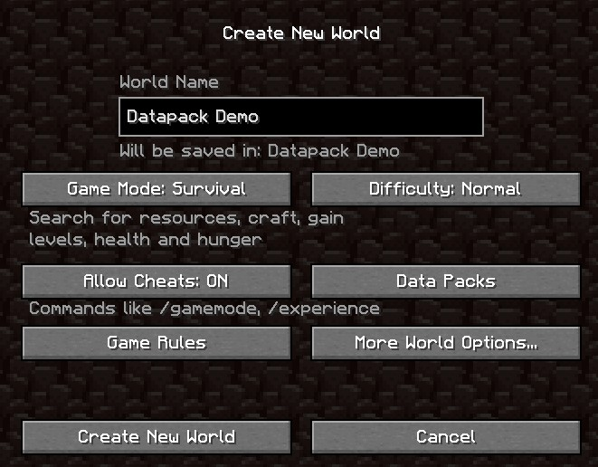
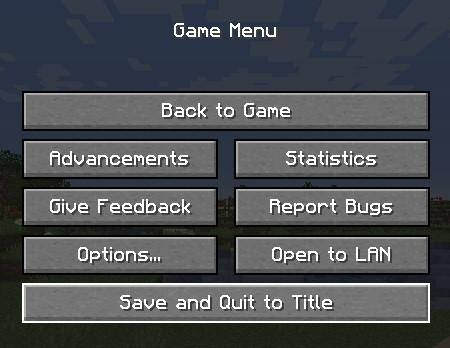
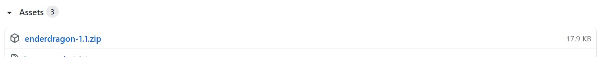
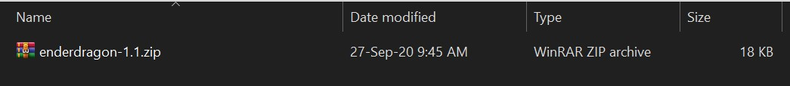
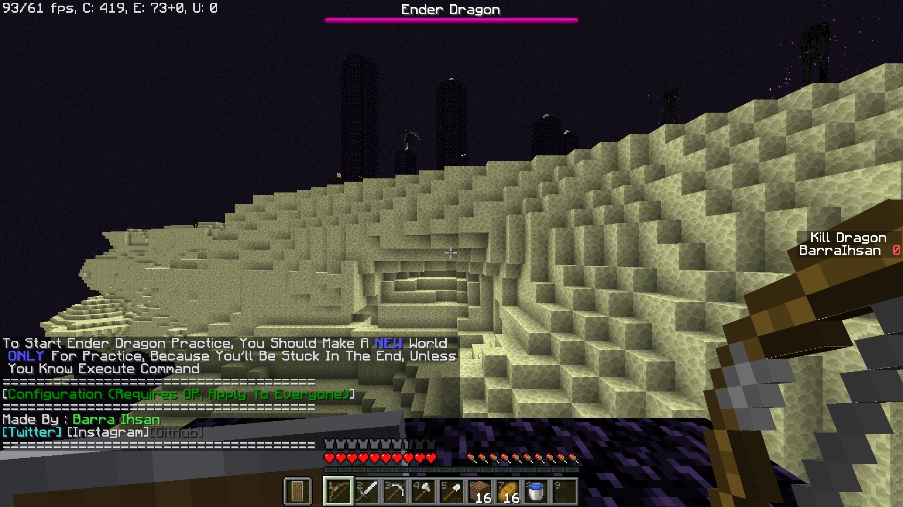

# Ender Dragon Practice - Datapack

Language : **English** | [Indonesia](README-id.md "Indonesia")

This datapack allows you to practice the Ender dragon

## Table of contents

-   [Info](#info)
-   [Setup](#setup)
-   [Setting](#Setting)

## Info

Please make a **NEW WORLD** only for this datapack, because your spawnpoint will be in the end. This datapack is only for version 1.16+, and compatible with multiplayer!

## Setup

Create a new world, then Save & Quit. (Make sure you turn on the cheat, because if not, you cannot open setting)

Go to [Release](https://github.com/barraIhsan/enderdragon/releases/ "Go to Release"), choose the version that you want to download, then go to asset, then choose `enderdragon-<version>.zip`

Download the datapack to [.minecraft](https://minecraft.gamepedia.com/.minecraft "Locate your .minecraft folder")/saves/\<World Name>\/datapacks/

After that, go to your world again, then Enjoy!

## Setting

| Setting Name          | Value                                      | Default Value | Description                                        |
| --------------------- | ------------------------------------------ | ------------- | -------------------------------------------------- |
| Difficulty            | Peaceful, Easy, Normal, Hard               | Normal        | Change the Difficulty that you play on             |
| Enderman              | Enable, Disable                            | Enable        | Enderman that naturally spawn                      |
| Dragon Fireball       | Enable, Disable                            | Enable        | -                                                  |
| Keep Inventory        | Enable, Disable                            | Enable        | -                                                  |
| Ultra Survival        | Enable, Disable                            | Disable       | Natural Regeneration                               |
| Glass Bottle          | Enable, Disable                            | Enable        | To clear all the Dragon Breath                     |
| End Crystal Actionbar | Enable, Disable                            | Enable        | Tell you how many End Crystal left to be destroyed |
| Unable to drop item   | Enable, Disable                            | Enable        | -                                                  |
| Health                | Enable, Disable                            | Enable        | Tell you people health                             |
| Select A Kit          | Woother, Stomail, Iron, Diamond, Netherite | Iron          | Select a different Kit to fight The Ender Dragon   |
